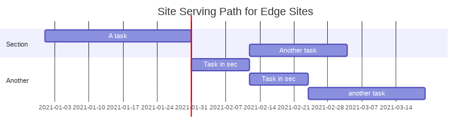
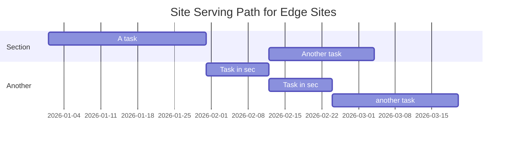

Graph:

<!-- generated by mermaid compile action - START -->

  
Mermaid markup

```mermaid
gantt
    title Site Serving Path for Edge Sites
    dateFormat  MM-DD

    section Section
    A task           :a1, 01-01, 30d
    Another task     :after a  , 20d

    section Another
    Task in sec      :a,after a1, 12d
    Task in sec      :after a, 12d
    another task      : 24d
```

<!-- generated by mermaid compile action - END -->
    

